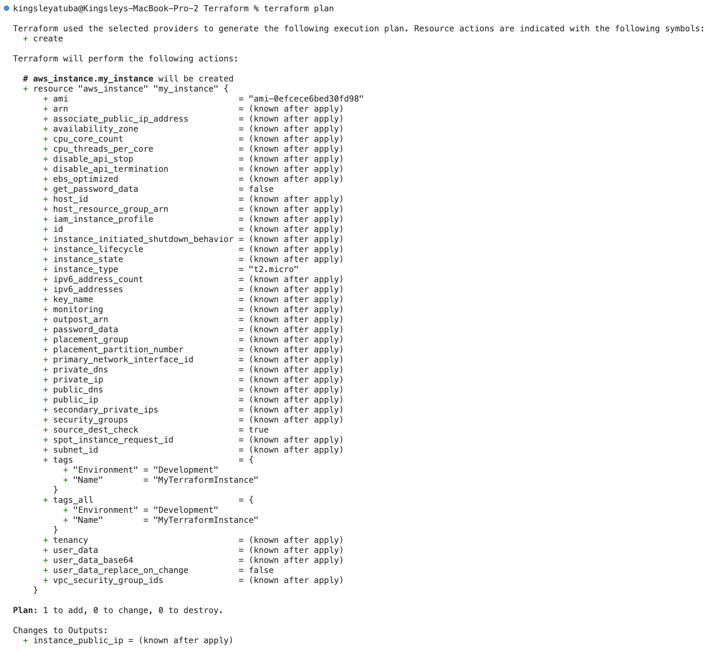

# Terraform


Terraform is like a magic wand for setting up and managing your cloud architecture. 
It helps you describe what you want (your infrastructure) and then implements it. 

## Importance of Terraform

> It's important because, first, it saves time by automating repetitive tasks, making it quicker to build and update your cloud environment. 

> it reduces errors because it follows your instructions exactly every time. 

> Third, it's flexible, allowing you to easily change and adapt your digital landscape. 

> Finally, it's a lifesaver for collaboration, 
as everyone can work together using the same the Terraform code.

## Some Terraform codes

1. For mac: `brew install terraform` 

2. Use the AWS CLI or AWS Cloudshell to find 10 AWS AMI images in us-east-1

```
aws ec2 describe-images \
  --owners amazon \
  --filters "Name=architecture,Values=x86_64" "Name=root-device-type,Values=ebs" "Name=virtualization-type,Values=hvm" \
  --region us-east-1 \
  --query 'Images[*].[ImageId, Name, Region]' \
  --max-items 10 \
  --output table
  ```


3. Check if an AMI is in a particular region

```
aws ec2 describe-images --image-ids ami-0638741e0c9aabde6 --region us-east-1
```


4. Create a new EC2 instance from that image by running this code from your main.tf file

```
# Configure the AWS provider
provider "aws" {
  region = "us-east-1" # Set your desired AWS region
  access_key = "my_access_key"  #replace this with your access key
  secret_key = "my_secret_access_key" #replace this with your secret access key
}

# Define an EC2 instance
resource "aws_instance" "my_instance" {
  ami           = "ami-0638741e0c9aabde6" 
  instance_type = "t2.micro"          

  tags = {
    Name        = "MyTerraformInstance"
    Environment = "Development"
  }
}

# Output the public IP address of the created instance
output "instance_public_ip" {
  value = aws_instance.my_instance.public_ip
}
```

5. `terraform init`:  gets everything ready for your Terraform project. 
It sets up the tools and space needed to make changes to your cloud setup and keeps track of those changes.


6. `terraform plan`:  checks what changes you want to make to your cloud setup without actually making those changes. 
It tells you what will be added, modified, or removed in your infrastructure.



7. `terraform apply`: is like saying "make it happen" to Terraform. 
It takes your planned changes and actually applies them to your cloud infrastructure, creating or modifying resources as needed.


8. Check you aws ec2 dashboard to confirm that ec2 is created


9. Terminate resources using `terraform destroy`


# Congratulations!!!
